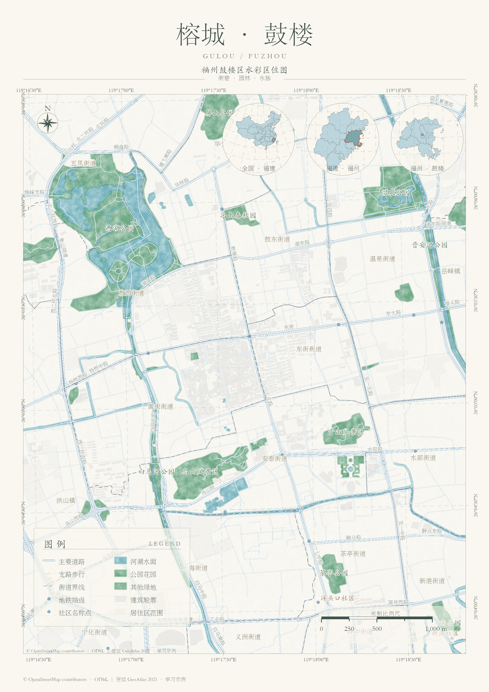

# InkMap ArcPy · 典雅水彩区位图

ArcGIS Pro 的 Python 制图包与 AI Agent skill。使用原生 CIM 叠层符号、真实要素数据和可编辑布局，复用蓝绿水彩、纸底、宋体标题、楷体地名与 Garamond 数字的风格。Agent 指使用 ArcPy 的 AI Agent。



**0.2.0** 新增 `atlas`：配置图层、取景范围与定位边界，即可输出完整布局、只有地图框的版本和纯地图内容。定位文字放在圆形下部内部；中心坐标只用于取景。图例与比例尺位于图框内，底板分别为 34% 和 40% 透明度。虚线经纬网、真北指针和米制比例尺均关联真实地图框。

## 安装

下载：[Python wheel](releases/0.2.0/inkmap_arcpy-0.2.0-py3-none-any.whl) · [独立 Agent skill ZIP](releases/0.2.0/arcpy-watercolor-map.zip) · [源码 ZIP](releases/0.2.0/inkmap-source.zip) · [SHA256 清单](releases/0.2.0/checksums.json)。

需要 Windows、已授权的 ArcGIS Pro 3.x 及其 Python 环境。已在 Pro **3.0 Advanced** 实际运行；其他小版本需要复测。包无额外运行依赖，ArcPy 由 Pro 提供。

```powershell
# 在 ArcGIS Pro Python Command Prompt 或其克隆环境中运行
python -m pip install --no-deps .\skills\arcpy-watercolor-map\assets\inkmap_arcpy-0.2.0-py3-none-any.whl
python -m inkmap_arcpy doctor
```

源码可设置 `PYTHONPATH` 为本项目的 `src` 目录运行。普通 Python 可读配置，不能执行 ArcPy 制图。

## 自动生成完整地图

先查确切地图名与图层 `longName`，再修改 [examples/atlas-job.json](examples/atlas-job.json)。相对路径以 JSON 所在目录为基准。

```powershell
python -m inkmap_arcpy inspect 'D:\GIS\input.aprx'
python -m inkmap_arcpy atlas .\examples\atlas-job.json --dry-run
python -m inkmap_arcpy atlas .\examples\atlas-job.json
```

`layers` 按配置顺序从底到顶绘制；每项可写角色字符串或带 `label_field` 的描述。输入项目和原数据保持原样，筛选后的要素复制进新 GDB，分类渲染有意统一为本主题。输出目录必须不存在。已绑定的图例最多十项，定位圈最多三个。默认 A4 竖版，可调配色、比例、网格间距与底板透明度；不支持任意页面尺寸。已有分类专题图仅需换样式时，使用下面的 `style` 接口。

```python
from inkmap_arcpy import compose_atlas, load_atlas_config
report = compose_atlas(load_atlas_config('atlas-job.json'))
```

| 输出 | 内容 |
|---|---|
| `atlas.aprx` / `atlas.gdb` | 可编辑项目、主图和定位地图、两套布局及本地要素 |
| `atlas_full.png` / `.pdf` | 标题、主图、图例、定位圈及页脚 |
| `atlas_frame.png` / `.pdf` | 去掉页外标题与页脚，保留地图框、网格标注、图例和定位圈 |
| `atlas_map_only.png` / `.pgw` | 只有地理内容，带世界文件，不含布局图例、定位圈或经纬网 |
| `atlas.pagx` / `atlas_report.json` | 布局模板与数量、连接、比例尺检查报告 |

PNG 默认 240 dpi；PDF 以 300 dpi 图像方式输出，编辑请使用 APRX。GDB 应随项目移动。定位圈接收带代码字段的真实 Polygon/MultiPolygon GeoJSON，不能从截图推测边界。主题要求适合当地、以米为单位的投影。字体为华文宋体、华文楷体与 Garamond，缺字体时需安装合法字体或在布局中替换。

## 直接换图层样式

```python
import arcpy
from inkmap_arcpy import apply_style
p = arcpy.mp.ArcGISProject('CURRENT')  # 仅 Pro 内部 Python 窗口 / Notebook
m = next(m for m in p.listMaps() if m.name == 'Map')
water = next(l for l in m.listLayers() if l.longName == 'Water')
apply_style(water, 'water', palette='watercolor', texture_size=95)
p.saveACopy(r'D:\GIS\watercolor.aprx')
```

`apply_style` 保留定义查询、标签与数据源；分类或分级渲染默认拒绝，有意替换时传 `replace_renderer=True`。在 CURRENT 中操作会立即改变内存图层。既有项目批处理运行 `python -m inkmap_arcpy style examples/style-job.json --dry-run`，再去掉 `--dry-run` 保存副本；该接口保留已有布局。

| 角色 | 几何 | 样式 |
|---|---|---|
| water / green | 面 | 水彩水面 / 绿地 |
| buildings / paper | 面 | 淡灰建筑 / 纸纹底面 |
| roads_main / roads_other | 线 | 白色内线与浅蓝外沿 |
| boundary / buffer | 线 | 边界虚线 / 距离圈虚线 |
| station / site | 点 | 圆形站点 / 十字场地 |

水体与绿地使用常规描边、渐变晕染、白色透明水彩纹理、半透明颜色及纸纹五层符号，图片以 base64 嵌入。纹理尺寸单位是点。`palette='ink'` 切换灰墨配色；`wash_path` / `paper_path` 可指定自有方形无缝纹理。`distance_rings` 返回投影坐标系中的米制欧氏距离圈；不计算路网可达范围。

## 福州鼓楼案例

[复现步骤与数据说明](examples/fuzhou/README.md)；[地图框预览](docs/images/gulou-frame.png)。道路、公园、建筑与街道信息来自 OpenStreetMap，社区仅是名称点，居住区不代表正式社区边界。2026 年园林名录只用于核对公园名称。定位圈使用 DataV GeoAtlas 发布的 2021 年边界，仅作宏观定位与学习示例。

街区数据署名与许可见 [OpenStreetMap / ODbL](https://www.openstreetmap.org/copyright)；定位边界来源与使用说明见 [DataV GeoAtlas](https://datav.aliyun.com/portal/school/atlas/atlas_aigc)。仓库不包含这些源数据缓存，示例图保留来源说明。地图不是官方测绘成果。

## AI Agent skill

把整个 [skills/arcpy-watercolor-map](skills/arcpy-watercolor-map) 文件夹复制到 Agent 的 skills 目录，例如 Codex 的 `~/.codex/skills/`。内附 0.2.0 wheel 与配置、风格和检查流程，可独立使用。

> 使用 $arcpy-watercolor-map，按典雅水彩风格制作我的 ArcGIS Pro 区位图。定位说明放在圈内下部，导出完整图与地图框版。

## 验证与发布

```powershell
python -m unittest discover -s tests -p 'test_*.py' -v
# Pro Python：检查原生关联、定位文字位置、重载连接与导出
python tests/pro_atlas_check.py 'D:\GIS\atlas-output'
# 开发环境需 setuptools + wheel；再生成纹理另需 NumPy + Pillow
python scripts/build_release.py
```

构建生成 0.2.0 wheel、独立 skill ZIP、源代码 ZIP 与 SHA256 清单。程序及默认原创周期纹理采用 MIT。参考文档里的旧纹理、旧安装包与带旧纹理的私人示例不进入公开发布。外部 GIS 数据及自定义素材的许可独立于代码。

技术参考：[Esri Python CIM access](https://doc.esri.com/en/arcgis-pro/latest/arcpy/mapping/python-cim-access.html)、[CIM Symbols](https://github.com/Esri/cim-spec/blob/main/docs/v3/CIMSymbols.md)。不支持 ArcMap、三维场景、云端 ArcGIS API for Python 或 AgentPy 仿真库。
