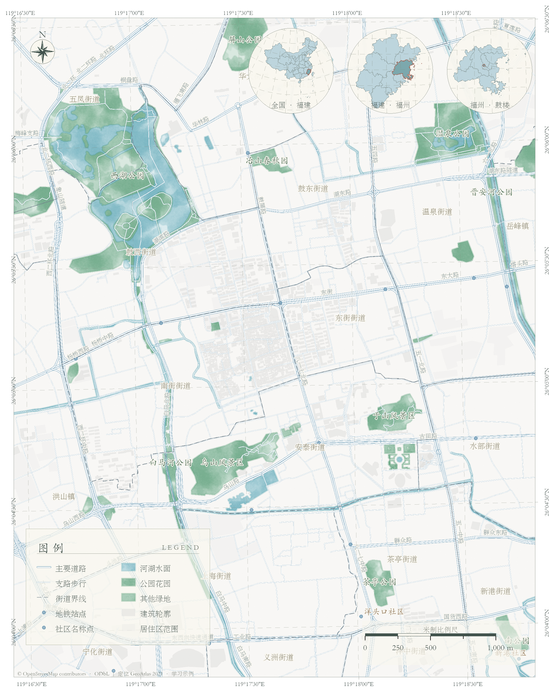

# 福州鼓楼 · 0.3.0 柔和湿墨案例

范围为福州中心城区局部，取景中心在鼓楼南街附近（119.294°E、26.086°N），只用于相机定位，图上无中心标记。EPSG:32650，1:21,000，A4竖版。定位文字在圆内下部，三圈依次为全国—福建、福建—福州、福州—鼓楼。



## 数据与语义

- [OpenStreetMap / ODbL](https://www.openstreetmap.org/copyright)，经 Overpass 提取。此次预览使用2026-10-08缓存，bbox WGS84 经度119.258–119.338、纬度26.020–26.110。重新下载的数量与边界可能变化。
- [福州市园林中心2026公园名录](https://ylj.fuzhou.gov.cn/zwgk/ztzl/gyjq/202607/t20260728_5351052.htm)用于名称核对：本次59条名录、16个OSM公园名称精确匹配。边界仍是OSM，不是官方测绘边界。
- [DataV GeoAtlas / Amap](https://datav.aliyun.com/portal/school/atlas/atlas_aigc)定位边界，areas_v3发布版本2021-05，供学习交流。下载日期不代表更新年份。坐标保留在独立小比例尺定位地图，未与OSM街区要素混合。源JSON不随仓库分发。

| 图层 | 本次要素数量 |
|---|---:|
| 主要道路 / 支路步行 | 1,674 / 3,014 |
| 河湖水面 / 内河水线 | 79 / 187 |
| 公园花园 / 其他绿地 | 75 / 111 |
| 建筑 / 居住区 | 2,832 / 567 |
| 街道乡镇范围 | 36 |
| 地铁站 / 社区名称点 | 31 / 6 |

社区仅是名称点，居住区不代表社区行政边界；街道也只是开放地图参考。数量为要素记录，道路路段和双向车道可能分别记录。全国定位包括发布源提供的省级要素与南海相关几何；没有自行补画边界。

## 从零复现

仓库不含本地数据缓存。先用普通 Python 下载和处理；`prepare_data.py`需要 shapely、pyproj、xlrd（开发依赖，不是制图包运行依赖）。下载脚本不会覆盖已有缓存。

```powershell
python examples/fuzhou/download_osm.py examples/fuzhou/data
python examples/fuzhou/download_parks.py
python examples/fuzhou/download_locators.py
python examples/fuzhou/prepare_data.py
```

然后在已授权的 **Pro Python** 中运行，先安装0.3.0 wheel，或把源码`src`加入PYTHONPATH：

```powershell
# 建立一次基础地图项目；输出用新目录
python examples/fuzhou/build_map.py examples/fuzhou/render-base
# 复用基础地图数据，建立独立典雅布局；不依赖私人旧版项目
python examples/fuzhou/build_atlas.py examples/fuzhou/render-base/fuzhou_watercolor.aprx examples/fuzhou/render-atlas --dry-run
python examples/fuzhou/build_atlas.py examples/fuzhou/render-base/fuzhou_watercolor.aprx examples/fuzhou/render-atlas
python tests/pro_atlas_check.py examples/fuzhou/render-atlas
```

正式制图只需现有数据项目与配置，直接调用包的`atlas`接口，不需要先跑福州脚本。`build_atlas.py`提供可复用的鼓楼任务配置函数。

## 输出与检查

`atlas_full.png/pdf`完整页、`atlas_frame.png/pdf`地图框版、`atlas_map_only.png/pgw`纯地图内容；`atlas.aprx`、`atlas.gdb`是可编辑成果。PNG240dpi、PDF300dpi图像；需要改布局或符号时打开APRX。移动项目请携带GDB并检查数据连接。

本机 Pro3.0实际保存重载：两套布局、主图及三个原生圆形框、无坏连接、定位高亮每圈恰好一个、文字位于圈内下部、WGS84虚线网格、米制比例尺与真北关联、无自动中心标记；另外查看PNG与PDF。

程序与新默认原创纹理为MIT。外部数据遵循各自条件；图内保留来源署名。旧私人参考纹理、旧wheel及旧项目不在此公开版本中。
