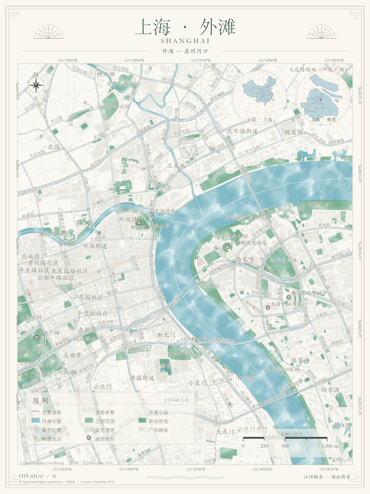
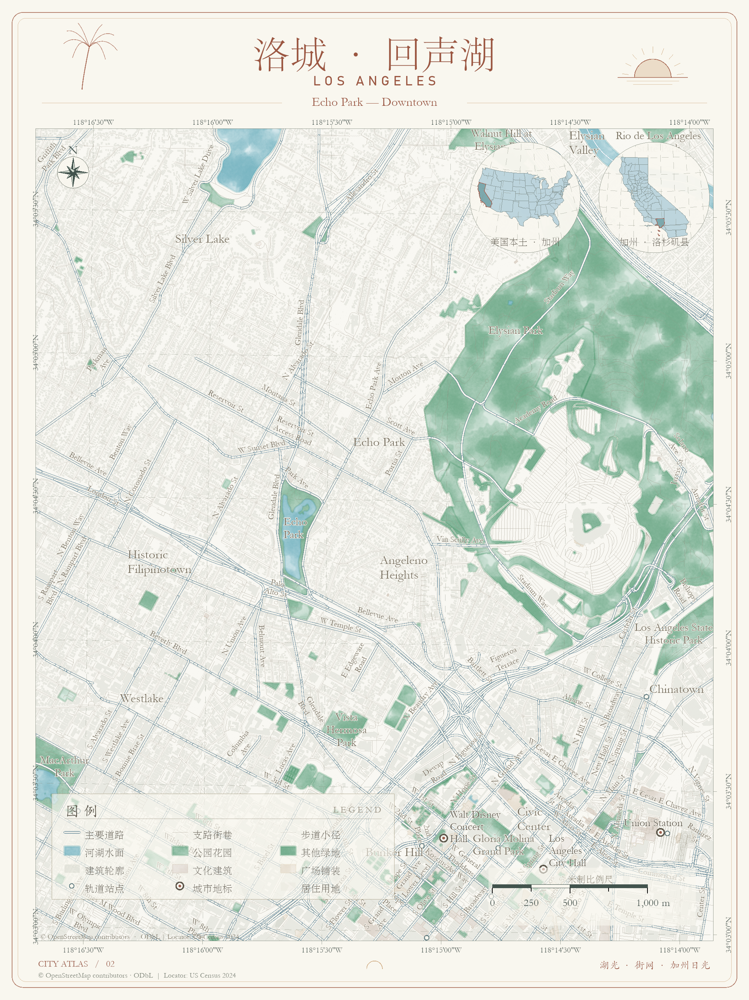

# 上海与洛杉矶 · 水墨城市案例

当前发布使用 `inkmap-arcpy 0.4.0` 与 `arcpy-watercolor-map` Skill。地图内容为原选柔和墨纹、纸白灰青主路、淡暖灰支路、细实线步道、薄墨建筑与空心站点；上海使用墨绿、黄铜及海派几何装帧，洛杉矶使用暖沙、日落橙、圆角与棕榈线描。所有地图与海报从原生 ArcGIS 布局导出。

新版数据入口优先使用 [三城复用资源包](../../releases/0.4.0/inkmap-toolkit-three-cities.zip) 内的 `import_sample_data.py`；它包含新增广场、历史建筑、步道及相应角色。下面的下载与城市装帧脚本保留基础案例流程，不能仅修改通用配置就自动推断城市装饰。新教程海报脚本为 `release_cards.py`，它用于维护者已有成果的排版，不是新城市数据下载入口。

0.3.0 使用选定的柔和湿墨底稿：纯白 RGB、变化 alpha 的墨纹位于半透明底色之上，纸纹独立托底。两张素材为512×512；墨纹112 pt、纸纹约72 pt，外缘轻淡。制图无需运行流体仿真，铺排仍需实际查看接缝。




案例为上海外滩—苏州河口与洛杉矶 Echo Park—Downtown。图幅均为城市局部，包含周边片区；地名点不推断社区边界。主图源为有界查询获得的 OpenStreetMap，要素记录保持真实 geometry；定位源为 DataV GeoAtlas 2021 与 US Census 2024。美国圈明确标为相连48州及DC的“美国本土”。

## 复现

在仓库根目录操作。普通 Python 准备数据，额外需要 Shapely / pyproj；图片清单检查需要 Pillow。这些不是制图包的运行依赖。

```powershell
python examples/two_cities/download_data.py shanghai
python examples/two_cities/download_la_tiles.py
python examples/two_cities/download_data.py locators
python examples/two_cities/prepare_data.py shanghai
python examples/two_cities/prepare_data.py losangeles
```

然后使用已授权的 Pro Python，安装0.3.0 wheel或设置PYTHONPATH为仓库`src`。下载调用按顺序执行并缓存；失败残缺响应不用于制图。

```powershell
python examples/two_cities/build_maps.py shanghai
python examples/two_cities/build_maps.py losangeles
python examples/two_cities/city_frames.py shanghai
python examples/two_cities/city_frames.py losangeles
python examples/two_cities/post_cards.py shanghai
python examples/two_cities/post_cards.py losangeles
python examples/two_cities/post_cards.py cover
python examples/two_cities/post_cards.py style
python examples/two_cities/validate_maps.py
```

最后用普通 Python 运行 `python examples/two_cities/package_post.py`，生成六张编号PNG、标题、正文话题、来源说明与发布ZIP，位于 `deliverables/shanghai-losangeles-2026-10-08`。发布图3:4竖版，21×28厘米、240dpi导出；细节页重新取景，保留真实比例尺与真北、经纬网关联。所有本机缓存与成果不进入Git。

初次 `build_maps` 输出目录必须不存在；复现时请用新目录或在明确了解当前示例生成目录的情况下自行清理。装帧/海报脚本用于重导本示例自己的成果，会替换同名导出。原生项目及随附 atlas.gdb 保存在 `render-shanghai` 与 `render-losangeles`。

程序与原创纹理沿用MIT；外部源数据许可独立。下载和概化级别见缓存metadata。发布ZIP中的图片与文字可按编号顺序使用。

来源：[OpenStreetMap](https://www.openstreetmap.org/copyright)、[DataV GeoAtlas](https://datav.aliyun.com/portal/school/atlas/atlas_aigc)、[US Census 2024](https://www2.census.gov/geo/tiger/GENZ2024/shp/)。
